Análisis instrumentos
================

# Método:

Este estudio contó con 3 etapas: traducción y adaptación, entrevistas
cognitivas y finalmente el análisis psicométricos.

El proceso de traducción y adaptación de los ítems tuvo como enfoque
reducir características irrelevantes del constructo a partir de una
adpatación que diera cuenta de las características culturales de la
población objetivo (APA, 2014). Por ello, los todos los ítems fueron
fueron traducidos de dos formas: una forma literal, y una forma
adaptada, buscando que esta última abordara los modos expresivos propios
de la cultura Chilena. Ambas traducciones, junto con los ítems en
inglés, fueron expuestos a un panel de 4 personas, compuesto por 2
psicolingüistas y 2 lingüistas, quienes analizaron y evaluaron las
traducciones siguiendo un proceso adaptado de Solano et al.(2012), en el
cual se analizan 10 dimensiones en que pueden haber errores de
adaptación en el proceso de traducción: estilo, formato, convenciones,
información, gramática, semántica, registro, cultura y origen (error en
el ítem en su versión original). Los ítems en los que se detectó algún
error fueron discutidos hasta que se llegó a un consenso respecto a una
versión final del ítem que no tuviera errores.

En el caso del MMQ, se consensuaron 15 ítems con errores, de los cuales
11 fueron en el área de registro (La traducción no refleja las formas
discursivas o expresivas locales (ej. la traducción suena poco natural
en el uso del lenguaje), 5 fueron en el área semántica (la traducción
altera el significado original), y 2 fueron en el área de información
(la traducción altera la cantidad de información).

En el caso del MentS se consensuaron 21 ítems con errores, de los cuales
19 fueron en el área del registro, 7 en el área semántica, 1 en el área
de información.

# Descripción de los datos:

## Sociodemográficos

### Datos perdidos:

Análisis inicial va a partir por los datos perdidos:

``` r
# Descripción datos perdidos ----------------------------------------------

datos = datos %>% rename(acuerdo = q0001, edad = q0002, genero = q0003, educacion = q0004,
                 estudias = q0005, estudio_actual = q0006)


## Nivel sociodemográfico:
naniar::miss_var_summary(datos[,11:16])
```

    ## # A tibble: 6 x 3
    ##   variable       n_miss pct_miss
    ##   <chr>           <int>    <dbl>
    ## 1 estudio_actual    141    33.4 
    ## 2 genero             14     3.32
    ## 3 educacion          14     3.32
    ## 4 estudias           14     3.32
    ## 5 acuerdo             0     0   
    ## 6 edad                0     0

``` r
vis_miss(datos[,11:16])
```

    ## Warning: `gather_()` was deprecated in tidyr 1.2.0.
    ## Please use `gather()` instead.
    ## This warning is displayed once every 8 hours.
    ## Call `lifecycle::last_lifecycle_warnings()` to see where this warning was generated.

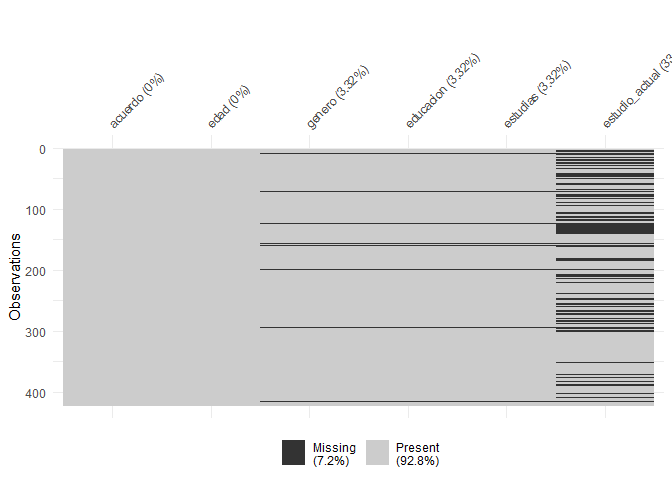<!-- -->

Se observa que quienes omiten en género, educación y estudio, son las
mismas personas. Quienes omiten en estudio actual son quienes no están
estudiando actualmente.

### Descripción de la muestra:

La variable de estudio actual permite construir una nueva variable
dummy, de estudiante universitario (Sí/No), dada la cantidad de personas
en la muestra que estudian en la universidad.

``` r
datos = datos %>% mutate(universitatio = case_when(
  educacion == "Educación media completa" &
    estudias == "Sí" &
    estudio_actual == "Universitaria"~"Sí",
  estudias == "No"~"No"))

datos = datos %>% mutate(estudio_actual = ifelse(estudias == "No","No",estudio_actual))
datos = datos %>% mutate(estudio_actual = factor(estudio_actual, levels = c("No",3,4), labels = c("No","Universitaria", "Postgrado")))

datos$edad = as.numeric(as.character(datos$edad))
```

``` r
summary(tableby(~edad+genero+educacion+estudias+estudio_actual, data = datos))
```

|                                                               | Overall (N=422) |
|:--------------------------------------------------------------|:---------------:|
| **edad**                                                      |                 |
|    N-Miss                                                     |       14        |
|    Mean (SD)                                                  | 29.113 (11.764) |
|    Range                                                      | 0.000 - 85.000  |
| **¿Con qué género te identificas?**                           |                 |
|    N-Miss                                                     |       14        |
|    Masculino                                                  |   126 (30.9%)   |
|    Femenino                                                   |   270 (66.2%)   |
|    Otro                                                       |    7 (1.7%)     |
|    Prefiero no decirlo                                        |    5 (1.2%)     |
| **¿Cuál es el nivel educacional más alto que has alcanzado?** |                 |
|    N-Miss                                                     |       14        |
|    Educación básica completa                                  |    0 (0.0%)     |
|    Educación media completa                                   |   208 (51.0%)   |
|    Educación técnico profesional completa                     |    25 (6.1%)    |
|    Educación universitaria completa                           |   100 (24.5%)   |
|    Educación de postgrado completa                            |   75 (18.4%)    |
| **¿Actualmente te encuentras estudiando?**                    |                 |
|    N-Miss                                                     |       14        |
|    Sí                                                         |   277 (67.9%)   |
|    No                                                         |   131 (32.1%)   |
| **estudio_actual**                                            |                 |
|    N-Miss                                                     |       18        |
|    No                                                         |   131 (32.4%)   |
|    Universitaria                                              |   225 (55.7%)   |
|    Postgrado                                                  |   48 (11.9%)    |

Diferencias entre personas según están estudiando actualmente:

``` r
summary(tableby(estudio_actual~edad+genero+educacion+estudias, data = datos))
```

|                                                               |   No (N=131)    | Universitaria (N=225) | Postgrado (N=48) |  Total (N=404)  |  p value |
|:--------------------------------------------------------------|:---------------:|:---------------------:|:----------------:|:---------------:|---------:|
| **edad**                                                      |                 |                       |                  |                 | \< 0.001 |
|    Mean (SD)                                                  | 39.420 (12.565) |    21.840 (4.266)     |  34.250 (8.494)  | 29.015 (11.690) |          |
|    Range                                                      | 0.000 - 85.000  |    17.000 - 49.000    | 23.000 - 70.000  | 0.000 - 85.000  |          |
| **¿Con qué género te identificas?**                           |                 |                       |                  |                 |    0.017 |
|    Masculino                                                  |   47 (35.9%)    |      56 (24.9%)       |    22 (45.8%)    |   125 (30.9%)   |          |
|    Femenino                                                   |   83 (63.4%)    |      159 (70.7%)      |    25 (52.1%)    |   267 (66.1%)   |          |
|    Otro                                                       |    0 (0.0%)     |       7 (3.1%)        |     0 (0.0%)     |    7 (1.7%)     |          |
|    Prefiero no decirlo                                        |    1 (0.8%)     |       3 (1.3%)        |     1 (2.1%)     |    5 (1.2%)     |          |
| **¿Cuál es el nivel educacional más alto que has alcanzado?** |                 |                       |                  |                 |          |
|    Educación básica completa                                  |    0 (0.0%)     |       0 (0.0%)        |     0 (0.0%)     |    0 (0.0%)     |          |
|    Educación media completa                                   |    2 (1.5%)     |      205 (91.1%)      |     1 (2.1%)     |   208 (51.5%)   |          |
|    Educación técnico profesional completa                     |   15 (11.5%)    |       8 (3.6%)        |     1 (2.1%)     |    24 (5.9%)    |          |
|    Educación universitaria completa                           |   55 (42.0%)    |       11 (4.9%)       |    32 (66.7%)    |   98 (24.3%)    |          |
|    Educación de postgrado completa                            |   59 (45.0%)    |       1 (0.4%)        |    14 (29.2%)    |   74 (18.3%)    |          |
| **¿Actualmente te encuentras estudiando?**                    |                 |                       |                  |                 | \< 0.001 |
|    Sí                                                         |    0 (0.0%)     |     225 (100.0%)      |   48 (100.0%)    |   273 (67.6%)   |          |
|    No                                                         |  131 (100.0%)   |       0 (0.0%)        |     0 (0.0%)     |   131 (32.4%)   |          |

# Instrumentos de mentalización:

## Datos perdidos:

### Omisiones en MMQ

``` r
naniar::miss_var_summary(datos[,17:49])
```

    ## # A tibble: 33 x 3
    ##    variable   n_miss pct_miss
    ##    <chr>       <int>    <dbl>
    ##  1 q0007_0001     55     13.0
    ##  2 q0007_0002     55     13.0
    ##  3 q0007_0003     55     13.0
    ##  4 q0007_0004     55     13.0
    ##  5 q0007_0005     55     13.0
    ##  6 q0007_0006     55     13.0
    ##  7 q0007_0007     55     13.0
    ##  8 q0007_0008     55     13.0
    ##  9 q0007_0009     55     13.0
    ## 10 q0007_0010     55     13.0
    ## # ... with 23 more rows

``` r
vis_miss(datos[,17:49])
```

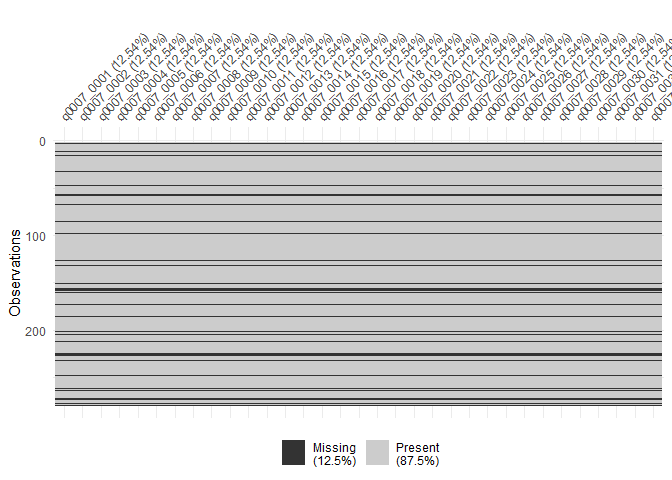<!-- -->

Las omisiones son estables en todo el instrumento.

### Omisiones en MentS

``` r
naniar::miss_var_summary(datos[,50:77])
```

    ## # A tibble: 28 x 3
    ##    variable   n_miss pct_miss
    ##    <chr>       <int>    <dbl>
    ##  1 q0008_0001     74     17.5
    ##  2 q0008_0002     74     17.5
    ##  3 q0008_0003     74     17.5
    ##  4 q0008_0004     74     17.5
    ##  5 q0008_0005     74     17.5
    ##  6 q0008_0006     74     17.5
    ##  7 q0008_0007     74     17.5
    ##  8 q0008_0008     74     17.5
    ##  9 q0008_0009     74     17.5
    ## 10 q0008_0010     74     17.5
    ## # ... with 18 more rows

``` r
vis_miss(datos[,50:77])
```

<!-- -->

### Omisiones en ambos instrumentos:

``` r
vis_miss(datos[,17:77])
```

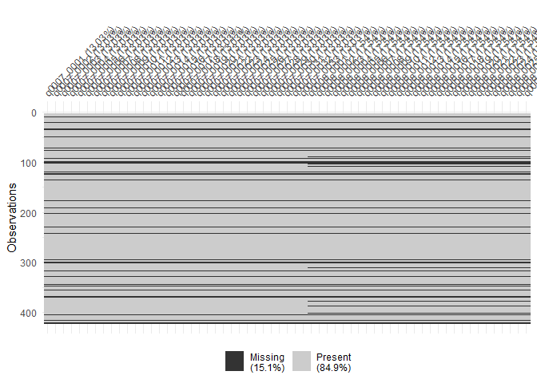<!-- -->

Las omisiones son estables en todo el instrumento.

### Caracterización de las omisiones:

``` r
datos = datos %>% mutate(omision_mentalizacion = ifelse(
  is.na(q0008_0001)==T,"sí","no"
))
```

``` r
summary(tableby(omision_mentalizacion~edad+genero+educacion+estudias+estudio_actual, data = datos))
```

|                                                               |   no (N=348)    |    sí (N=74)    |  Total (N=422)  | p value |
|:--------------------------------------------------------------|:---------------:|:---------------:|:---------------:|--------:|
| **edad**                                                      |                 |                 |                 |   0.724 |
|    N-Miss                                                     |        0        |       14        |       14        |         |
|    Mean (SD)                                                  | 29.198 (11.870) | 28.617 (11.210) | 29.113 (11.764) |         |
|    Range                                                      | 0.000 - 85.000  | 18.000 - 67.000 | 0.000 - 85.000  |         |
| **¿Con qué género te identificas?**                           |                 |                 |                 |   0.469 |
|    N-Miss                                                     |        0        |       14        |       14        |         |
|    Masculino                                                  |   103 (29.6%)   |   23 (38.3%)    |   126 (30.9%)   |         |
|    Femenino                                                   |   234 (67.2%)   |   36 (60.0%)    |   270 (66.2%)   |         |
|    Otro                                                       |    6 (1.7%)     |    1 (1.7%)     |    7 (1.7%)     |         |
|    Prefiero no decirlo                                        |    5 (1.4%)     |    0 (0.0%)     |    5 (1.2%)     |         |
| **¿Cuál es el nivel educacional más alto que has alcanzado?** |                 |                 |                 |         |
|    N-Miss                                                     |        0        |       14        |       14        |         |
|    Educación básica completa                                  |    0 (0.0%)     |    0 (0.0%)     |    0 (0.0%)     |         |
|    Educación media completa                                   |   176 (50.6%)   |   32 (53.3%)    |   208 (51.0%)   |         |
|    Educación técnico profesional completa                     |    18 (5.2%)    |    7 (11.7%)    |    25 (6.1%)    |         |
|    Educación universitaria completa                           |   83 (23.9%)    |   17 (28.3%)    |   100 (24.5%)   |         |
|    Educación de postgrado completa                            |   71 (20.4%)    |    4 (6.7%)     |   75 (18.4%)    |         |
| **¿Actualmente te encuentras estudiando?**                    |                 |                 |                 |   0.937 |
|    N-Miss                                                     |        0        |       14        |       14        |         |
|    Sí                                                         |   236 (67.8%)   |   41 (68.3%)    |   277 (67.9%)   |         |
|    No                                                         |   112 (32.2%)   |   19 (31.7%)    |   131 (32.1%)   |         |
| **estudio_actual**                                            |                 |                 |                 |   0.700 |
|    N-Miss                                                     |        2        |       16        |       18        |         |
|    No                                                         |   112 (32.4%)   |   19 (32.8%)    |   131 (32.4%)   |         |
|    Universitaria                                              |   191 (55.2%)   |   34 (58.6%)    |   225 (55.7%)   |         |
|    Postgrado                                                  |   43 (12.4%)    |    5 (8.6%)     |   48 (11.9%)    |         |

Hasta el momento los grupos son similares.

## Descripción de los instrumentos:

### Descripción y depuración del MMQ:

El MMQ cuenta con 6 factores, 3 de los cuales dan cuenta de aspectos
positivos y 3 de aspectos negativos. No cuenta con ítems invertidos,
aunque el contenido es negativo para el caso de los factores negativos
(ej. A veces experimento cambios de ánimo que no puedo controlar),

``` r
nombres_MMQ = labelled::var_label(datos_un[,17:49])
nombres_MMQ = unlist(nombres_MMQ)
items_mmq = datos_un %>% select(17:49)
items_mmq = na.omit(items_mmq)
```

``` r
colnames(items_mmq) = nombres_MMQ
```

``` r
items_mmq %>% gather(key=item,value=respuesta,1:33) %>%
  filter(is.na(respuesta)==F) %>% 
  mutate(respuesta = factor(respuesta, levels = c("Totalmente en desacuerdo",
                            "En desacuerdo",
                            "Ni de acuerdo ni en desacuerdo",
                            "De acuerdo",
                            "Muy de acuerdo"))) %>%
  count(item,respuesta) %>% group_by(item) %>% 
  mutate(porc = round(n/sum(n),3)*100) %>% 
  ggplot(aes(x=item, y=porc, fill=respuesta)) +
  geom_col() +
  coord_flip() +
  theme_bw() +
  theme(legend.position = "bottom", axis.text.y = element_text(size = 6.5, color = "black")) +
  guides(fill=guide_legend(nrow=3,byrow=TRUE)) +
  geom_text(aes(label=str_c(porc,"%")), position = "stack", size=2)
```

    ## Warning: attributes are not identical across measure variables;
    ## they will be dropped

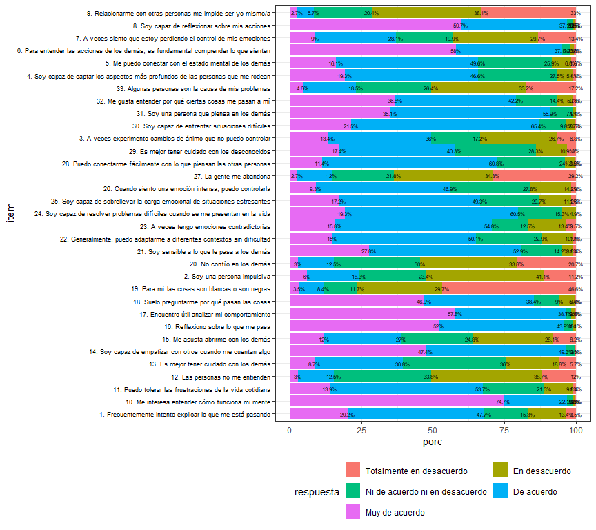<!-- -->

### Análisis de subescalas:

El instrumento cuenta con 6 subescalas, compuestas de la siguiente
manera:

**Escalas positivas:**

F1 (reflexión): 1,6,8,10,16,17,18,31,32

F2 (ego-strength): 11,22,24,25,26,30

F3 (relational attunement): 4,5,14,21,28

**Escalas negativas:**

F4 (relational discomfort): 9,12,15,27,33

F5 (distrust): 13,19,20,29

F6 (emotional discontrol):2,3,7,23

¿Cuántos factores extraer?

``` r
psych::fa.parallel((datos[,17:49]))
```

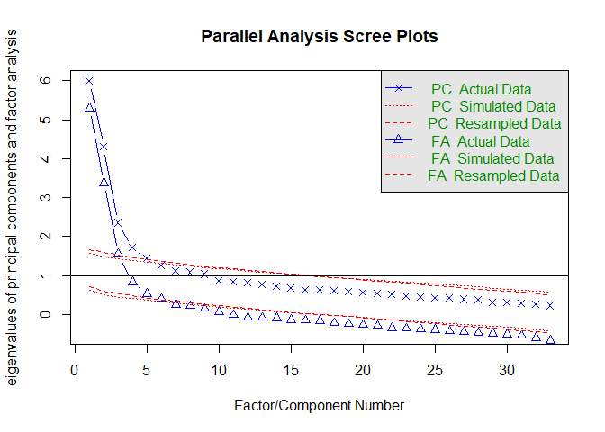<!-- -->

    ## Parallel analysis suggests that the number of factors =  6  and the number of components =  5

Al parecer es una buena solución 6 factores

``` r
print(fa(datos[,17:49], nfactors = 6,rotate = "oblimin", cor = "poly"),cut = .2)
```

    ## Loading required namespace: GPArotation

    ## Factor Analysis using method =  minres
    ## Call: fa(r = datos[, 17:49], nfactors = 6, rotate = "oblimin", cor = "poly")
    ## Standardized loadings (pattern matrix) based upon correlation matrix
    ##              MR1   MR2   MR5   MR3   MR4   MR6   h2   u2 com
    ## q0007_0001        0.28       -0.23             0.16 0.84 2.9
    ## q0007_0002              0.68                   0.40 0.60 1.1
    ## q0007_0003              0.64                   0.60 0.40 1.3
    ## q0007_0004                          0.75       0.63 0.37 1.1
    ## q0007_0005                          0.80       0.63 0.37 1.1
    ## q0007_0006 -0.25                    0.20  0.45 0.36 0.64 3.2
    ## q0007_0007              0.68                   0.66 0.34 1.2
    ## q0007_0008  0.24  0.56                         0.40 0.60 1.5
    ## q0007_0009 -0.29              0.22       -0.36 0.36 0.64 2.8
    ## q0007_0010        0.69                         0.55 0.45 1.2
    ## q0007_0011  0.51       -0.24                   0.47 0.53 1.6
    ## q0007_0012              0.27  0.22       -0.39 0.47 0.53 3.1
    ## q0007_0013                    0.81             0.66 0.34 1.0
    ## q0007_0014              0.20        0.29  0.43 0.52 0.48 2.9
    ## q0007_0015                    0.40             0.28 0.72 1.6
    ## q0007_0016        0.85                         0.74 0.26 1.1
    ## q0007_0017        0.73                         0.59 0.41 1.0
    ## q0007_0018        0.64                         0.46 0.54 1.1
    ## q0007_0019              0.50             -0.23 0.29 0.71 1.8
    ## q0007_0020                    0.60       -0.24 0.51 0.49 1.4
    ## q0007_0021                          0.23  0.38 0.40 0.60 3.3
    ## q0007_0022  0.56                               0.37 0.63 1.2
    ## q0007_0023        0.20  0.57                   0.43 0.57 1.4
    ## q0007_0024  0.83                               0.78 0.22 1.1
    ## q0007_0025  0.82                               0.74 0.26 1.1
    ## q0007_0026  0.61       -0.32                   0.60 0.40 1.5
    ## q0007_0027              0.25  0.20       -0.47 0.53 0.47 2.7
    ## q0007_0028                          0.72       0.58 0.42 1.2
    ## q0007_0029                    0.81             0.62 0.38 1.1
    ## q0007_0030  0.89                               0.83 0.17 1.1
    ## q0007_0031              0.20        0.24  0.47 0.49 0.51 2.2
    ## q0007_0032        0.37                         0.28 0.72 2.1
    ## q0007_0033              0.33  0.21       -0.23 0.33 0.67 3.2
    ## 
    ##                        MR1  MR2  MR5  MR3  MR4  MR6
    ## SS loadings           4.01 3.09 2.90 2.53 2.40 1.80
    ## Proportion Var        0.12 0.09 0.09 0.08 0.07 0.05
    ## Cumulative Var        0.12 0.22 0.30 0.38 0.45 0.51
    ## Proportion Explained  0.24 0.18 0.17 0.15 0.14 0.11
    ## Cumulative Proportion 0.24 0.42 0.60 0.75 0.89 1.00
    ## 
    ##  With factor correlations of 
    ##       MR1  MR2   MR5   MR3  MR4   MR6
    ## MR1  1.00 0.23 -0.35 -0.24 0.15  0.16
    ## MR2  0.23 1.00  0.14  0.12 0.37  0.21
    ## MR5 -0.35 0.14  1.00  0.32 0.24 -0.06
    ## MR3 -0.24 0.12  0.32  1.00 0.00 -0.24
    ## MR4  0.15 0.37  0.24  0.00 1.00  0.22
    ## MR6  0.16 0.21 -0.06 -0.24 0.22  1.00
    ## 
    ## Mean item complexity =  1.7
    ## Test of the hypothesis that 6 factors are sufficient.
    ## 
    ## The degrees of freedom for the null model are  528  and the objective function was  17.88 with Chi Square of  7315.51
    ## The degrees of freedom for the model are 345  and the objective function was  3.61 
    ## 
    ## The root mean square of the residuals (RMSR) is  0.04 
    ## The df corrected root mean square of the residuals is  0.05 
    ## 
    ## The harmonic number of observations is  367 with the empirical chi square  586  with prob <  9.7e-15 
    ## The total number of observations was  422  with Likelihood Chi Square =  1464.67  with prob <  1.4e-137 
    ## 
    ## Tucker Lewis Index of factoring reliability =  0.745
    ## RMSEA index =  0.088  and the 90 % confidence intervals are  0.083 0.092
    ## BIC =  -620.85
    ## Fit based upon off diagonal values = 0.98
    ## Measures of factor score adequacy             
    ##                                                    MR1  MR2  MR5  MR3  MR4  MR6
    ## Correlation of (regression) scores with factors   0.96 0.94 0.92 0.92 0.92 0.87
    ## Multiple R square of scores with factors          0.93 0.89 0.85 0.85 0.85 0.76
    ## Minimum correlation of possible factor scores     0.86 0.78 0.70 0.70 0.70 0.51

### Estructura interna:

**Respecto a reflexibility:** la estructura general se mantiene de forma
parcial, el ítem 6 y el 31 no están asociados al factor:

6.- Para entender las acciones de los demás, es fundamental comprender
lo que sienten

31.- Soy una persona que piensa en los demás.

Ambos ítems cargan al mismo factor, relational discomfort (ej. 27.- La
gente me abandona)

**Respecto a ego-strength:** la estructura general se mantiene.

**Respecto a relational attunement:** (ej. 5.- Me puedo conectar con el
estado mental de los demás). La estructura general se mantiene, aunque
hay dos ítems con cargas factoriales notablemente más bajas.

14.- Soy capaz de empatizar con otros cuando me cuentan algo.

21.- Soy sensible a lo que le pasa a los demás.

Estos ítems parecen estar más asociados a relational discomfort.

**Respecto a relational discomfort:** la estructura se mantiene de forma
parcial, el ítem 15 no se asocia al factor.

15.- Me asusta abrirme con los demás.

Este ítem está más asociado a distrust (ej. 13.- Es mejor tener cuidado
con los demás)

También el ítem 33 está muy poco asociado a este factor:

33.- Algunas personas son la causa de mis problemas

y está más asociado al factor emotional discontrol (ej. 7.- A veces
siento que estoy perdiendo el control de mis emociones)

Por último, este factor recibe cargas factoriales de los ítems 6, 14, 21
y 31:

6.- Para entender las acciones de los demás, es fundamental comprender
lo que sienten.

14.- Soy capaz de empatizar con otros cuando me cuentan algo.

21.- Soy sensible a lo que le pasa a los demás.

31.- Soy una persona que piensa en los demás.

Las cargas factoriales promedios son bajas, por lo que no queda claro el
contenido de este factor.

**Respecto a distrust:** la estructura se mantiene de forma parcial, el
ítem 19 no se asocia al mismo factor:

19.- Para mí las cosas son blancas o son negras.

Este ítem carga al factor emotional discontrol (ej. 2.- Soy una persona
impulsiva)

El ítem 15 (15.- Me asusta abrirme con los demás) si bien teóricamente
se lo ubicaba en relational discomfort, ahora se lo ubica en distrust
(ej. Es mejor tener cuidado con los desconocidos).

**Respecto a emotional discontrol:** la estructura se mantiene en su
totalidad, aunque habría que agregar el 19:

19.- Para mí las cosas son blancas o son negras

**Notas generales:**

El factor menos claro en cuanto a su contenido es emotional discomfort,
ya que las cargas de los ítems teóricamente asociados es baja (menores a
.50) y además tienden a cargar al mismo factor que otros 4 ítems,
teóricamente asociados a factores distintos:

6.- Para entender las acciones de los demás, es fundamental comprender
lo que sienten.

14.- Soy capaz de empatizar con otros cuando me cuentan algo.

21.- Soy sensible a lo que le pasa a los demás.

31.- Soy una persona que piensa en los demás.

Todos estos ítems tienen cargas bajas en general, y muestran su mayor
asociación con los ítems de emotional discomfort. Respecto al ítem 14 y
21 (originalmente de relational attunement), el 6 y el 31
(reflexibility), una hipótesis es que comparten en su contenido la
sensibilidad por los demás, de manera afectiva. En particular, el factor
de relational attunement agrupa ítems centrados en la empatía cognitiva,
y los ítems 14 y 21 tienen que ver con empatía afectiva. Por otro lado,
en reflexibility los ítems se centran en analizar el propio
comportamiento, y los ítems 6 y 31 se centran en la preocupación por los
demás.

Por su parte, relational attunement prácticamente perdió la mitad de sus
ítems asociados, ya que solo cargan fuertemente al mismo factor:

4.- Soy capaz de captar los aspectos más profundos de las personas que
me rodean.

5.- Me puedo conectar con el estado mental de los demás.

28.- Puedo conectarme fácilmente con lo que piensan las otras personas.

A su vez el ítem 15 (Me asusta abrirme con los demás) se asocia al
factor distrust.

El ítem 19 (Para mí las cosas son blancas o son negras) se asocia a
emotional discontrol

### Descripción y depuración del MentS:

El instrumento cuenta con 3 factores (motivation, self y others), y
algunos ítems están reversados.

``` r
nombres_MentS = labelled::var_label(datos_un[,50:77])
nombres_MentS = unlist(nombres_MentS)
items_ments = datos_un %>% select(50:77)
items_ments = na.omit(items_ments)
```

Descriptivos:

``` r
nombres_MentS = str_sub(nombres_MentS, start = 1, end = 100)
colnames(items_ments) = nombres_MentS
items_ments %>% gather(key=item, value = respuesta) %>% mutate(respuesta = factor(respuesta, levels = c("Totalmente en desacuerdo",
                            "En desacuerdo",
                            "Ni de acuerdo ni en desacuerdo",
                            "De acuerdo",
                            "Muy de acuerdo"))) %>%
  count(item,respuesta) %>% group_by(item) %>% 
  mutate(porc = round(n/sum(n),3)*100) %>% 
  ggplot(aes(x=item, y=porc, fill=respuesta)) +
  geom_col() +
  coord_flip() +
  theme_bw() +
  theme(legend.position = "bottom", axis.text.y = element_text(size = 6.5, color = "black")) +
  guides(fill=guide_legend(nrow=3,byrow=TRUE)) +
  geom_text(aes(label=str_c(porc,"%")), position = "stack", size=2)
```

    ## Warning: attributes are not identical across measure variables;
    ## they will be dropped

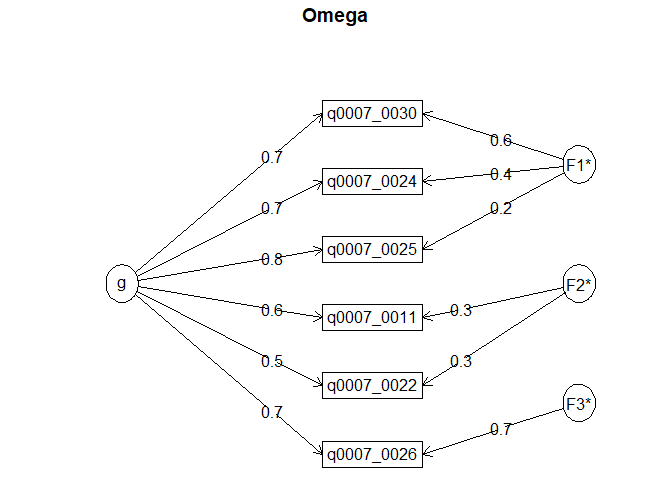<!-- -->

Ahora hay que reversal los ítems en negativo:

8, 9, 11, 14, 18, 19, 21, 22, 26, 27

``` r
ments = datos[,50:77]
ments = na.omit(ments)
ments = ments %>% mutate(across(.cols = c(8,9,11,14,18,19,21,22,26,27), .fns = function(x){
  x = 6-x
}))
```

``` r
library(corrplot)
```

    ## corrplot 0.92 loaded

``` r
corrplot(cor(ments),order="hclust",addrect =3)
```

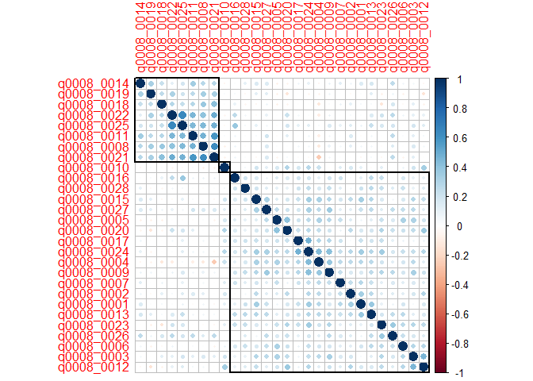<!-- -->

``` r
fa.parallel(ments)
```

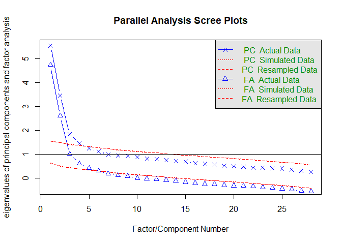<!-- -->

    ## Parallel analysis suggests that the number of factors =  5  and the number of components =  4

``` r
fa_ments = fa(ments, nfactors = 3, rotate = "oblimin", cor = "poly")
print(fa_ments, cut = 0.3)
```

    ## Factor Analysis using method =  minres
    ## Call: fa(r = ments, nfactors = 3, rotate = "oblimin", cor = "poly")
    ## Standardized loadings (pattern matrix) based upon correlation matrix
    ##              MR2   MR1   MR3   h2   u2 com
    ## q0008_0001        0.73       0.46 0.54 1.1
    ## q0008_0002        0.35       0.22 0.78 1.6
    ## q0008_0003              0.67 0.54 0.46 1.1
    ## q0008_0004        0.49  0.31 0.47 0.53 2.3
    ## q0008_0005              0.61 0.43 0.57 1.1
    ## q0008_0006              0.43 0.35 0.65 1.7
    ## q0008_0007        0.47       0.23 0.77 1.0
    ## q0008_0008  0.69             0.48 0.52 1.0
    ## q0008_0009        0.47       0.36 0.64 1.4
    ## q0008_0010              0.47 0.22 0.78 1.0
    ## q0008_0011  0.66             0.46 0.54 1.0
    ## q0008_0012              0.65 0.44 0.56 1.0
    ## q0008_0013        0.60       0.41 0.59 1.1
    ## q0008_0014  0.41  0.42 -0.31 0.35 0.65 2.8
    ## q0008_0015        0.57       0.34 0.66 1.0
    ## q0008_0016                   0.21 0.79 2.4
    ## q0008_0017        0.43       0.24 0.76 1.1
    ## q0008_0018  0.58             0.35 0.65 1.1
    ## q0008_0019  0.47             0.25 0.75 1.4
    ## q0008_0020              0.67 0.46 0.54 1.0
    ## q0008_0021  0.88             0.76 0.24 1.0
    ## q0008_0022  0.74             0.59 0.41 1.1
    ## q0008_0023              0.52 0.37 0.63 1.2
    ## q0008_0024        0.67       0.58 0.42 1.2
    ## q0008_0025  0.68             0.55 0.45 1.2
    ## q0008_0026                   0.30 0.70 2.8
    ## q0008_0027        0.43       0.26 0.74 1.3
    ## q0008_0028        0.43       0.25 0.75 1.2
    ## 
    ##                        MR2  MR1  MR3
    ## SS loadings           3.83 3.84 3.24
    ## Proportion Var        0.14 0.14 0.12
    ## Cumulative Var        0.14 0.27 0.39
    ## Proportion Explained  0.35 0.35 0.30
    ## Cumulative Proportion 0.35 0.70 1.00
    ## 
    ##  With factor correlations of 
    ##      MR2  MR1  MR3
    ## MR2 1.00 0.15 0.11
    ## MR1 0.15 1.00 0.42
    ## MR3 0.11 0.42 1.00
    ## 
    ## Mean item complexity =  1.4
    ## Test of the hypothesis that 3 factors are sufficient.
    ## 
    ## The degrees of freedom for the null model are  378  and the objective function was  12.16 with Chi Square of  4094.23
    ## The degrees of freedom for the model are 297  and the objective function was  3.38 
    ## 
    ## The root mean square of the residuals (RMSR) is  0.06 
    ## The df corrected root mean square of the residuals is  0.07 
    ## 
    ## The harmonic number of observations is  348 with the empirical chi square  882.51  with prob <  2e-59 
    ## The total number of observations was  348  with Likelihood Chi Square =  1132.35  with prob <  9.6e-98 
    ## 
    ## Tucker Lewis Index of factoring reliability =  0.712
    ## RMSEA index =  0.09  and the 90 % confidence intervals are  0.085 0.096
    ## BIC =  -605.75
    ## Fit based upon off diagonal values = 0.95
    ## Measures of factor score adequacy             
    ##                                                    MR2  MR1  MR3
    ## Correlation of (regression) scores with factors   0.95 0.93 0.92
    ## Multiple R square of scores with factors          0.90 0.86 0.84
    ## Minimum correlation of possible factor scores     0.81 0.72 0.69

**Respecto al factor de Motivation:**

Los ítems que cargan al mismo factor teórico son: 1,4,7,9,13,15,17,24,27

1.- Encuentro importante entender las razones de mis acciones.

4.- Suelo pensar en otras personas y su comportamiento

7.- Cuando alguien me cae mal, trato de entender por qué siento eso

9.- No me gusta perder el tiempo tratando de entender el comportamiento
de los demás.

13.- Encuentro importante entender lo que pasa en mis relaciones con
personas cercanas

15.- Para entender por qué alguien hace algo, necesitamos saber lo que
piensa, quiere y siente

17.- Me gusta leer sobre temas relacionados con psicología.

24.- Siempre me ha interesado saber por qué las personas se comportan de
la manera en que lo hacen

27.- No tiene sentido pensar en las intenciones y deseos de los demás
porque todos dependemos de las circunstancias de la vida

A eso habría que sumarle el ítem 2,14 y 28, aunque con cargas más bajas:

2.- Para sacar conclusiones sobre la personalidad de los demás, me fijo
en lo que dicen y hacen

14.- Prefiero no saber algo de mí si no me va a gustar

28.- Una de las cosas más importantes que deben aprender los/as niños/as
es a expresar sus sentimientos y deseos

El ítem 16, por su parte, no se asocia al factor de motivación, ni
tampoco a ningún otro claramente.

16.- Suelo hablar de emociones con mis cercanos

***Resumen del factor Motivation:***

El factor está centrado en buscar entender la conducta y emociones
propias y de los demás, es decir, de mentalizar a las personas y a sí
mismo. Esto también vinculado con actitudes en entender el mundo
psíquico. El ítem 16, no necesariamente tiene que ver con interés en
buscar entender el mundo psíquico propio y de los demás, y apunta a la
frecuencia de una conducta, la cual puede ocurrir o no ocurrir por
variadas circunstancias.

**Respecto al factor de Others:**

Los ítems que cargan al mismo factor teórico son: 3, 5, 6, 12, 20, 23.

3.- Puedo reconocer los sentimientos de los demás

5.- Suelo darme cuenta de lo que hace sentir incómodas a las personas

6.- Puedo empatizar con los sentimientos de los demás. (marginalmente)

10.- Puedo predecir lo que van a hacer los demás si conozco sus
creencias y sentimientos (marginalmente).

12.- A veces, puedo comprender lo que el otro siente antes de que me lo
diga

20.- Puedo describir con precisión y detalle la personalidad de mis
cercanos

23.- Las personas me dicen que las entiendo y que les doy buenos
consejos

Los ítems que debieran cargar y no lo hacen son: 2, 25 y 28

2.- Para sacar conclusiones sobre la personalidad de los demás, me fijo
en lo que dicen y hacen.

25.- Puedo describir fácilmente lo que siento

28.- Una de las cosas más importantes que deben aprender los/as niños/as
es a expresar sus sentimientos y deseos.

***Descripción del factor otros:***

Está vinculado a la percepción de la propia capacidad para comprender a
los demás (sus sentimientos o lo que piensan) y empatizar con lo que
sienten. El ítem 2, 25, 28 no están asociados al factor debido a que no
aluden a la capacidad de comprender a otros.

**Respecto al factor Self:**

Los ítems que cargan al factor tórico son los 8, 11, 14, 18, 19, 21, 22,
26:

8.- Cuando estoy mal de ánimo, no estoy seguro/a si es tristeza, miedo o
rabia

11.- Con frecuencia, ni a mí me puedo explicar por qué hice algo

14.- Prefiero no saber algo de mí si no me va a gustar (carga menos que
para el factor motivation)

18.- Me cuesta reconocer ante mí mismo que estoy triste, dolido o
asustado

19.- No me gusta pensar en mis problemas

21.- Suelo confundirme acerca de cuáles son mis sentimientos

22.- Me cuesta encontrar las palabras adecuadas para expresar mis
sentimientos

26.- Suelo distraerme cuando la gente me habla de sus sentimientos y
necesidades (marginalmente)

A estos ítems se le suma el ítem 25:

25.- Puedo describir fácilmente lo que siento

***Descripción del factor Self:***

A nivel central, refiere a la percepción del grado de claridad/confusión
que tiene una persona respecto a sus propios pensamientos, emociones y
acciones.

# Relación con otras variables:

### EQ:

El Empathy Quotient \[EQ\] fue adaptado a la población chilena y cuenta
con evidencia de validez en esta población (revisar paper). Este
instrumento cuenta con 3 subdimensiones: empatía cognitiva, reactividad
emocional y habilidades sociales.

``` r
items_eq = datos %>% dplyr::select(starts_with("q0009"))
```

``` r
naniar::miss_var_summary(items_eq)
```

    ## # A tibble: 60 x 3
    ##    variable   n_miss pct_miss
    ##    <chr>       <int>    <dbl>
    ##  1 q0009_0001    112     26.5
    ##  2 q0009_0002    112     26.5
    ##  3 q0009_0003    112     26.5
    ##  4 q0009_0004    112     26.5
    ##  5 q0009_0005    112     26.5
    ##  6 q0009_0006    112     26.5
    ##  7 q0009_0007    112     26.5
    ##  8 q0009_0008    112     26.5
    ##  9 q0009_0009    112     26.5
    ## 10 q0009_0010    112     26.5
    ## # ... with 50 more rows

``` r
vis_miss(items_eq)
```

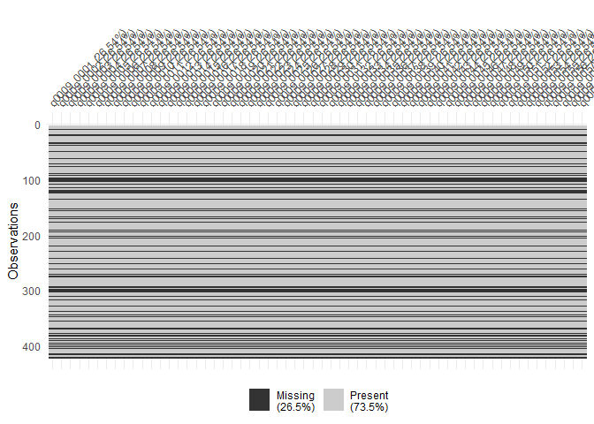<!-- -->

``` r
items_eq$eq_ec = rowSums(items_eq[,c(1,19,25,26,36,41,43,44,52,54,55,58,60)])
```

``` r
items_eq$eq_hs = rowSums(items_eq[,c(4,8,12,14,21,35,57)])
```

``` r
items_eq$eq_re = rowSums(items_eq[,c(15,27,32,42,46,48,49,50,59)])
```

### IRI:

El Interpersonal reactivity index (IRI) cuenta con 4 factores:

Fantasy Scale (FS); Perspective taking (PT); Empathic Concern (EC) and
Personal Distress (PD) scales

``` r
items_iri = datos %>% select(starts_with("q0010"))
```

``` r
naniar::miss_var_summary(items_iri)
```

    ## # A tibble: 28 x 3
    ##    variable   n_miss pct_miss
    ##    <chr>       <int>    <dbl>
    ##  1 q0010_0001    125     29.6
    ##  2 q0010_0002    125     29.6
    ##  3 q0010_0003    125     29.6
    ##  4 q0010_0004    125     29.6
    ##  5 q0010_0005    125     29.6
    ##  6 q0010_0006    125     29.6
    ##  7 q0010_0007    125     29.6
    ##  8 q0010_0008    125     29.6
    ##  9 q0010_0009    125     29.6
    ## 10 q0010_0010    125     29.6
    ## # ... with 18 more rows

``` r
vis_miss(items_iri)
```

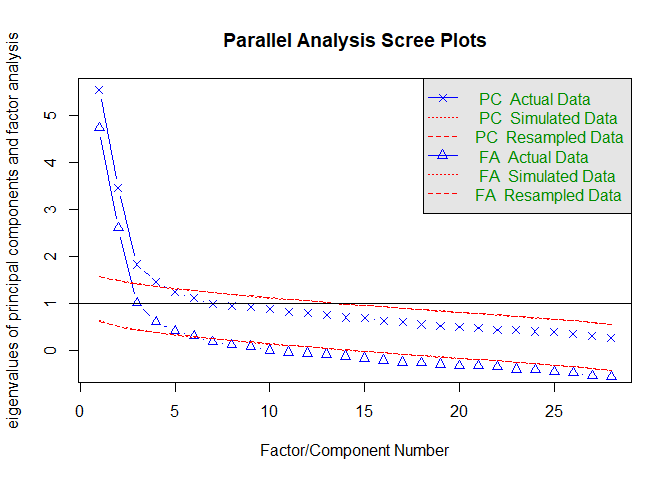<!-- -->

Reversar ítems:

``` r
items_iri$fs = NULL

items_iri = items_iri %>% mutate(across(.cols = c(3,4,7,12,13,14,15,18,19), .fns = function(x){6-x}))

corrplot(cor(items_iri,use="complete.obs"), order = "hclust", addrect = 4)
```

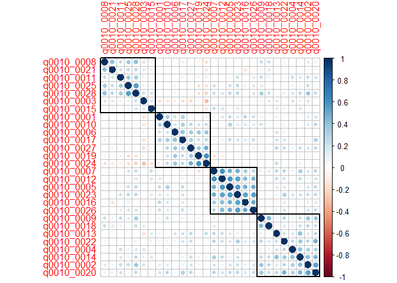<!-- -->

``` r
items_iri$fs = rowSums(items_iri[,c(1,5,7,12,16,20,26)])

items_iri$pd = rowSums(items_iri[,c(6,10,13,17,19,24,27)])

items_iri$pt = rowSums(items_iri[,c(3,8,11,15,21,25,28)])

items_iri$ec = rowSums(items_iri[,c(2,4,9,14,18,20,22)])
```

## Buss Perry Aggression Questionnaire (BPAQ)

Este instrumento está compuesto por 4 factores: agresión física,
agresión verbal, rabia y hostilidad.

Agresión física: 1,5,9,17,21,27,29

Agresión verbal: 2,6,14,18

Anger: 3,7,11,22

Hostilidad: 4,16,20,26,28

``` r
items_aq = datos %>% select(starts_with("q0011"))
```

``` r
naniar::miss_var_summary(items_aq)
```

    ## # A tibble: 29 x 3
    ##    variable   n_miss pct_miss
    ##    <chr>       <int>    <dbl>
    ##  1 q0011_0001    132     31.3
    ##  2 q0011_0002    132     31.3
    ##  3 q0011_0003    132     31.3
    ##  4 q0011_0004    132     31.3
    ##  5 q0011_0005    132     31.3
    ##  6 q0011_0006    132     31.3
    ##  7 q0011_0007    132     31.3
    ##  8 q0011_0008    132     31.3
    ##  9 q0011_0009    132     31.3
    ## 10 q0011_0010    132     31.3
    ## # ... with 19 more rows

``` r
vis_miss(items_aq)
```

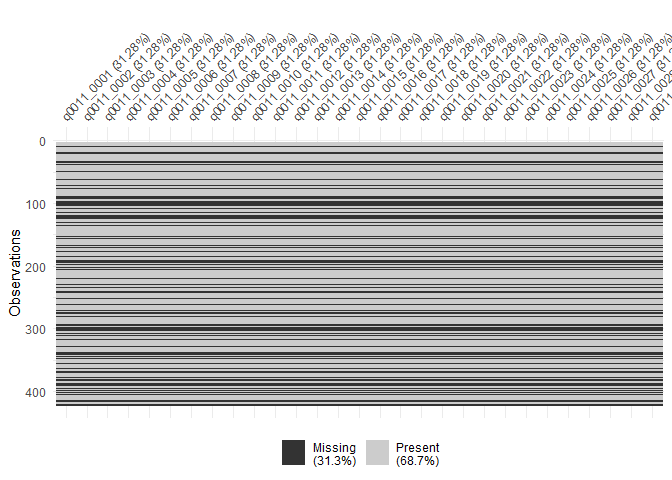<!-- -->

Agresión física: 1,5,9,17,21,27,29

Agresión verbal: 2,6,14,18

Anger: 3,7,11,22

Hostilidad: 4,16,20,26,28

``` r
items_aq$af = rowSums(items_aq[,c(1,5,9,17,21,27,29)])
items_aq$av = rowSums(items_aq[,c(2,6,14,18)])
items_aq$ang = rowSums(items_aq[,c(3,7,11,22)])
items_aq$host = rowSums(items_aq[,c(4,16,20,26,28)])
```
