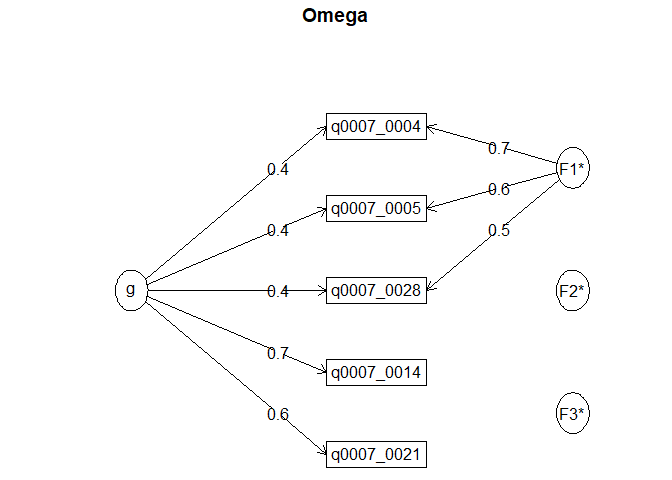
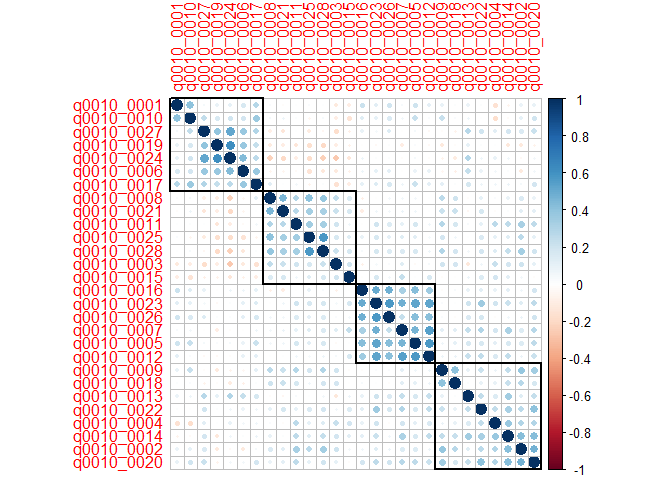

Análisis instrumentos
================

# Descripción de los datos:

## Sociodemográficos

### Datos perdidos:

Análisis inicial va a partir por los datos perdidos:

``` r
# Descripción datos perdidos ----------------------------------------------

datos = datos %>% rename(acuerdo = q0001, edad = q0002, genero = q0003, educacion = q0004,
                 estudias = q0005, estudio_actual = q0006)


## Nivel sociodemográfico:
naniar::miss_var_summary(datos[,11:16])
```

    ## # A tibble: 6 x 3
    ##   variable       n_miss pct_miss
    ##   <chr>           <int>    <dbl>
    ## 1 estudio_actual     88    28.7 
    ## 2 genero             10     3.26
    ## 3 educacion          10     3.26
    ## 4 estudias           10     3.26
    ## 5 acuerdo             0     0   
    ## 6 edad                0     0

``` r
vis_miss(datos[,11:16])
```

    ## Warning: `gather_()` was deprecated in tidyr 1.2.0.
    ## Please use `gather()` instead.
    ## This warning is displayed once every 8 hours.
    ## Call `lifecycle::last_lifecycle_warnings()` to see where this warning was generated.

<!-- -->

Se observa que quienes omiten en género, educación y estudio, son las
mismas personas. Quienes omiten en estudio actual son quienes no están
estudiando actualmente.

### Descripción de la muestra:

La variable de estudio actual permite construir una nueva variable
dummy, de estudiante universitario (Sí/No), dada la cantidad de personas
en la muestra que estudian en la universidad.

``` r
datos = datos %>% mutate(universitatio = case_when(
  educacion == "Educación media completa" &
    estudias == "Sí" &
    estudio_actual == "Universitaria"~"Sí",
  estudias == "No"~"No"))

datos = datos %>% mutate(estudio_actual = ifelse(estudias == "No","No",estudio_actual))
datos = datos %>% mutate(estudio_actual = factor(estudio_actual, levels = c("No",3,4), labels = c("No","Universitaria", "Postgrado")))

datos$edad = as.numeric(as.character(datos$edad))
```

``` r
summary(tableby(~edad+genero+educacion+estudias+estudio_actual, data = datos))
```

|                                                               | Overall (N=307) |
|:--------------------------------------------------------------|:---------------:|
| **edad**                                                      |                 |
|    N-Miss                                                     |       10        |
|    Mean (SD)                                                  | 28.253 (12.714) |
|    Range                                                      | 17.000 - 85.000 |
| **¿Con qué género te identificas?**                           |                 |
|    N-Miss                                                     |       10        |
|    Masculino                                                  |   90 (30.3%)    |
|    Femenino                                                   |   198 (66.7%)   |
|    Otro                                                       |    6 (2.0%)     |
|    Prefiero no decirlo                                        |    3 (1.0%)     |
| **¿Cuál es el nivel educacional más alto que has alcanzado?** |                 |
|    N-Miss                                                     |       10        |
|    Educación básica completa                                  |    0 (0.0%)     |
|    Educación media completa                                   |   184 (62.0%)   |
|    Educación técnico profesional completa                     |    14 (4.7%)    |
|    Educación universitaria completa                           |   45 (15.2%)    |
|    Educación de postgrado completa                            |   54 (18.2%)    |
| **¿Actualmente te encuentras estudiando?**                    |                 |
|    N-Miss                                                     |       10        |
|    Sí                                                         |   217 (73.1%)   |
|    No                                                         |   80 (26.9%)    |
| **estudio_actual**                                            |                 |
|    N-Miss                                                     |       10        |
|    No                                                         |   80 (26.9%)    |
|    Universitaria                                              |   195 (65.7%)   |
|    Postgrado                                                  |    22 (7.4%)    |

Diferencias entre personas según están estudiando actualmente:

``` r
summary(tableby(estudio_actual~edad+genero+educacion+estudias, data = datos))
```

|                                                               |    No (N=80)    | Universitaria (N=195) | Postgrado (N=22) |  Total (N=297)  |  p value |
|:--------------------------------------------------------------|:---------------:|:---------------------:|:----------------:|:---------------:|---------:|
| **edad**                                                      |                 |                       |                  |                 | \< 0.001 |
|    Mean (SD)                                                  | 43.013 (13.547) |    21.451 (3.840)     | 34.864 (12.112)  | 28.253 (12.714) |          |
|    Range                                                      | 23.000 - 85.000 |    17.000 - 49.000    | 23.000 - 70.000  | 17.000 - 85.000 |          |
| **¿Con qué género te identificas?**                           |                 |                       |                  |                 |    0.001 |
|    Masculino                                                  |   31 (38.8%)    |      45 (23.1%)       |    14 (63.6%)    |   90 (30.3%)    |          |
|    Femenino                                                   |   49 (61.2%)    |      141 (72.3%)      |    8 (36.4%)     |   198 (66.7%)   |          |
|    Otro                                                       |    0 (0.0%)     |       6 (3.1%)        |     0 (0.0%)     |    6 (2.0%)     |          |
|    Prefiero no decirlo                                        |    0 (0.0%)     |       3 (1.5%)        |     0 (0.0%)     |    3 (1.0%)     |          |
| **¿Cuál es el nivel educacional más alto que has alcanzado?** |                 |                       |                  |                 |          |
|    Educación básica completa                                  |    0 (0.0%)     |       0 (0.0%)        |     0 (0.0%)     |    0 (0.0%)     |          |
|    Educación media completa                                   |    1 (1.2%)     |      182 (93.3%)      |     1 (4.5%)     |   184 (62.0%)   |          |
|    Educación técnico profesional completa                     |    8 (10.0%)    |       5 (2.6%)        |     1 (4.5%)     |    14 (4.7%)    |          |
|    Educación universitaria completa                           |   26 (32.5%)    |       7 (3.6%)        |    12 (54.5%)    |   45 (15.2%)    |          |
|    Educación de postgrado completa                            |   45 (56.2%)    |       1 (0.5%)        |    8 (36.4%)     |   54 (18.2%)    |          |
| **¿Actualmente te encuentras estudiando?**                    |                 |                       |                  |                 | \< 0.001 |
|    Sí                                                         |    0 (0.0%)     |     195 (100.0%)      |   22 (100.0%)    |   217 (73.1%)   |          |
|    No                                                         |   80 (100.0%)   |       0 (0.0%)        |     0 (0.0%)     |   80 (26.9%)    |          |

# Instrumentos de mentalización:

## Datos perdidos:

### Omisiones en MMQ

``` r
naniar::miss_var_summary(datos[,17:49])
```

    ## # A tibble: 33 x 3
    ##    variable   n_miss pct_miss
    ##    <chr>       <int>    <dbl>
    ##  1 q0007_0001     39     12.7
    ##  2 q0007_0002     39     12.7
    ##  3 q0007_0003     39     12.7
    ##  4 q0007_0004     39     12.7
    ##  5 q0007_0005     39     12.7
    ##  6 q0007_0006     39     12.7
    ##  7 q0007_0007     39     12.7
    ##  8 q0007_0008     39     12.7
    ##  9 q0007_0009     39     12.7
    ## 10 q0007_0010     39     12.7
    ## # ... with 23 more rows

``` r
vis_miss(datos[,17:49])
```

<!-- -->

Las omisiones son estables en todo el instrumento.

### Omisiones en MentS

``` r
naniar::miss_var_summary(datos[,50:77])
```

    ## # A tibble: 28 x 3
    ##    variable   n_miss pct_miss
    ##    <chr>       <int>    <dbl>
    ##  1 q0008_0001     50     16.3
    ##  2 q0008_0002     50     16.3
    ##  3 q0008_0003     50     16.3
    ##  4 q0008_0004     50     16.3
    ##  5 q0008_0005     50     16.3
    ##  6 q0008_0006     50     16.3
    ##  7 q0008_0007     50     16.3
    ##  8 q0008_0008     50     16.3
    ##  9 q0008_0009     50     16.3
    ## 10 q0008_0010     50     16.3
    ## # ... with 18 more rows

``` r
vis_miss(datos[,50:77])
```

<!-- -->

### Omisiones en ambos instrumentos:

``` r
vis_miss(datos[,17:77])
```

<!-- -->

Las omisiones son estables en todo el instrumento.

### Caracterización de las omisiones:

``` r
datos = datos %>% mutate(omision_mentalizacion = ifelse(
  is.na(q0008_0001)==T,"sí","no"
))
```

``` r
summary(tableby(omision_mentalizacion~edad+genero+educacion+estudias+estudio_actual, data = datos))
```

|                                                               |   no (N=257)    |    sí (N=50)    |  Total (N=307)  | p value |
|:--------------------------------------------------------------|:---------------:|:---------------:|:---------------:|--------:|
| **edad**                                                      |                 |                 |                 |   0.669 |
|    N-Miss                                                     |        0        |       10        |       10        |         |
|    Mean (SD)                                                  | 28.377 (12.867) | 27.450 (11.810) | 28.253 (12.714) |         |
|    Range                                                      | 17.000 - 85.000 | 18.000 - 67.000 | 17.000 - 85.000 |         |
| **¿Con qué género te identificas?**                           |                 |                 |                 |   0.655 |
|    N-Miss                                                     |        0        |       10        |       10        |         |
|    Masculino                                                  |   75 (29.2%)    |   15 (37.5%)    |   90 (30.3%)    |         |
|    Femenino                                                   |   174 (67.7%)   |   24 (60.0%)    |   198 (66.7%)   |         |
|    Otro                                                       |    5 (1.9%)     |    1 (2.5%)     |    6 (2.0%)     |         |
|    Prefiero no decirlo                                        |    3 (1.2%)     |    0 (0.0%)     |    3 (1.0%)     |         |
| **¿Cuál es el nivel educacional más alto que has alcanzado?** |                 |                 |                 |         |
|    N-Miss                                                     |        0        |       10        |       10        |         |
|    Educación básica completa                                  |    0 (0.0%)     |    0 (0.0%)     |    0 (0.0%)     |         |
|    Educación media completa                                   |   159 (61.9%)   |   25 (62.5%)    |   184 (62.0%)   |         |
|    Educación técnico profesional completa                     |    9 (3.5%)     |    5 (12.5%)    |    14 (4.7%)    |         |
|    Educación universitaria completa                           |   38 (14.8%)    |    7 (17.5%)    |   45 (15.2%)    |         |
|    Educación de postgrado completa                            |   51 (19.8%)    |    3 (7.5%)     |   54 (18.2%)    |         |
| **¿Actualmente te encuentras estudiando?**                    |                 |                 |                 |   0.497 |
|    N-Miss                                                     |        0        |       10        |       10        |         |
|    Sí                                                         |   186 (72.4%)   |   31 (77.5%)    |   217 (73.1%)   |         |
|    No                                                         |   71 (27.6%)    |    9 (22.5%)    |   80 (26.9%)    |         |
| **estudio_actual**                                            |                 |                 |                 |   0.677 |
|    N-Miss                                                     |        0        |       10        |       10        |         |
|    No                                                         |   71 (27.6%)    |    9 (22.5%)    |   80 (26.9%)    |         |
|    Universitaria                                              |   168 (65.4%)   |   27 (67.5%)    |   195 (65.7%)   |         |
|    Postgrado                                                  |    18 (7.0%)    |    4 (10.0%)    |    22 (7.4%)    |         |

Hasta el momento los grupos son similares.

## Descripción de los instrumentos:

### Descripción y depuración del MMQ:

El MMQ cuenta con 6 factores, 3 de los cuales dan cuenta de aspectos
positivos y 3 de aspectos negativos. No cuenta con ítems invertidos,
aunque el contenido es negativo para el caso de los factores negativos
(ej. A veces experimento cambios de ánimo que no puedo controlar),

``` r
nombres_MMQ = labelled::var_label(datos_un[,17:49])
nombres_MMQ = unlist(nombres_MMQ)
items_mmq = datos_un %>% select(17:49)
items_mmq = na.omit(items_mmq)
```

``` r
colnames(items_mmq) = nombres_MMQ
```

``` r
items_mmq %>% gather(key=item,value=respuesta,1:33) %>%
  filter(is.na(respuesta)==F) %>% 
  mutate(respuesta = factor(respuesta, levels = c("Totalmente en desacuerdo",
                            "En desacuerdo",
                            "Ni de acuerdo ni en desacuerdo",
                            "De acuerdo",
                            "Muy de acuerdo"))) %>%
  count(item,respuesta) %>% group_by(item) %>% 
  mutate(porc = round(n/sum(n),3)*100) %>% 
  ggplot(aes(x=item, y=porc, fill=respuesta)) +
  geom_col() +
  coord_flip() +
  theme_bw() +
  theme(legend.position = "bottom", axis.text.y = element_text(size = 6.5, color = "black")) +
  guides(fill=guide_legend(nrow=3,byrow=TRUE)) +
  geom_text(aes(label=str_c(porc,"%")), position = "stack", size=2)
```

    ## Warning: attributes are not identical across measure variables;
    ## they will be dropped

<!-- -->

### Análisis de subescalas:

El instrumento cuenta con 6 subescalas, compuestas de la siguiente
manera:

**Escalas positivas:**

F1 (reflexión): 1,6,8,10,16,17,18,31,32

F2 (ego-strength): 11,22,24,25,26,30

F3 (relational attunement): 4,5,14,21,28

**Escalas negativas:**

F4 (relational discomfort): 9,12,15,27,33

F5 (distrust): 13,19,20,29

F6 (emotional discontrol):2,3,7,23

¿Cuántos factores extraer?

``` r
psych::fa.parallel((datos[,17:49]))
```

<!-- -->

    ## Parallel analysis suggests that the number of factors =  6  and the number of components =  5

Al parecer es una buena solución 6 factores

``` r
print(fa(datos[,17:49], nfactors = 6,rotate = "oblimin"),cut = .2)
```

    ## Loading required namespace: GPArotation

    ## Factor Analysis using method =  minres
    ## Call: fa(r = datos[, 17:49], nfactors = 6, rotate = "oblimin")
    ## Standardized loadings (pattern matrix) based upon correlation matrix
    ##              MR1   MR6   MR4   MR2   MR3   MR5   h2   u2 com
    ## q0007_0001              0.24       -0.20       0.12 0.88 2.9
    ## q0007_0002        0.58                         0.30 0.70 1.2
    ## q0007_0003        0.73                         0.63 0.37 1.1
    ## q0007_0004                    0.71             0.52 0.48 1.1
    ## q0007_0005                    0.73             0.51 0.49 1.0
    ## q0007_0006                    0.23       -0.39 0.26 0.74 2.7
    ## q0007_0007        0.72                         0.66 0.34 1.1
    ## q0007_0008  0.24        0.46 -0.21             0.31 0.69 2.3
    ## q0007_0009 -0.29                          0.37 0.31 0.69 2.3
    ## q0007_0010              0.60                   0.42 0.58 1.2
    ## q0007_0011  0.45 -0.25                         0.45 0.55 1.8
    ## q0007_0012 -0.22                          0.48 0.47 0.53 1.9
    ## q0007_0013                          0.76       0.59 0.41 1.0
    ## q0007_0014        0.20        0.30       -0.35 0.35 0.65 3.0
    ## q0007_0015                          0.32       0.24 0.76 2.1
    ## q0007_0016              0.75                   0.58 0.42 1.1
    ## q0007_0017              0.56                   0.39 0.61 1.2
    ## q0007_0018              0.57                   0.36 0.64 1.4
    ## q0007_0019        0.38                         0.21 0.79 2.1
    ## q0007_0020                          0.57       0.46 0.54 1.3
    ## q0007_0021                    0.26       -0.35 0.33 0.67 3.7
    ## q0007_0022  0.53                               0.35 0.65 1.2
    ## q0007_0023        0.48                         0.33 0.67 1.5
    ## q0007_0024  0.77                               0.68 0.32 1.1
    ## q0007_0025  0.75                               0.69 0.31 1.1
    ## q0007_0026  0.50 -0.32                         0.50 0.50 1.8
    ## q0007_0027                                0.53 0.52 0.48 1.7
    ## q0007_0028                    0.62             0.47 0.53 1.3
    ## q0007_0029                          0.77       0.56 0.44 1.1
    ## q0007_0030  0.80                               0.63 0.37 1.1
    ## q0007_0031                    0.25       -0.33 0.29 0.71 2.8
    ## q0007_0032              0.33  0.23             0.23 0.77 2.5
    ## q0007_0033        0.28                    0.35 0.37 0.63 2.9
    ## 
    ##                        MR1  MR6  MR4  MR2  MR3  MR5
    ## SS loadings           3.34 2.66 2.25 2.11 2.03 1.71
    ## Proportion Var        0.10 0.08 0.07 0.06 0.06 0.05
    ## Cumulative Var        0.10 0.18 0.25 0.31 0.38 0.43
    ## Proportion Explained  0.24 0.19 0.16 0.15 0.14 0.12
    ## Cumulative Proportion 0.24 0.43 0.58 0.73 0.88 1.00
    ## 
    ##  With factor correlations of 
    ##       MR1   MR6   MR4   MR2   MR3   MR5
    ## MR1  1.00 -0.44  0.14  0.06 -0.27 -0.22
    ## MR6 -0.44  1.00  0.18  0.27  0.30  0.15
    ## MR4  0.14  0.18  1.00  0.26  0.14 -0.08
    ## MR2  0.06  0.27  0.26  1.00  0.01 -0.13
    ## MR3 -0.27  0.30  0.14  0.01  1.00  0.31
    ## MR5 -0.22  0.15 -0.08 -0.13  0.31  1.00
    ## 
    ## Mean item complexity =  1.7
    ## Test of the hypothesis that 6 factors are sufficient.
    ## 
    ## The degrees of freedom for the null model are  528  and the objective function was  12.25 with Chi Square of  3604.43
    ## The degrees of freedom for the model are 345  and the objective function was  2.03 
    ## 
    ## The root mean square of the residuals (RMSR) is  0.04 
    ## The df corrected root mean square of the residuals is  0.04 
    ## 
    ## The harmonic number of observations is  268 with the empirical chi square  364.38  with prob <  0.23 
    ## The total number of observations was  307  with Likelihood Chi Square =  590.18  with prob <  4e-15 
    ## 
    ## Tucker Lewis Index of factoring reliability =  0.876
    ## RMSEA index =  0.048  and the 90 % confidence intervals are  0.042 0.055
    ## BIC =  -1385.59
    ## Fit based upon off diagonal values = 0.97
    ## Measures of factor score adequacy             
    ##                                                    MR1  MR6 MR4  MR2  MR3  MR5
    ## Correlation of (regression) scores with factors   0.94 0.92 0.9 0.89 0.90 0.85
    ## Multiple R square of scores with factors          0.89 0.84 0.8 0.79 0.80 0.73
    ## Minimum correlation of possible factor scores     0.78 0.68 0.6 0.59 0.61 0.45

### Estructura interna:

**Respecto a reflexibility:** la estructura general se mantiene de forma
parcial, el ítem 6 no está asociado al factor.

**Respecto a ego-strength:** la estructura general se mantiene.

**Respecto a relational attunement:** la estructura general se mantiene.

**Respecto a relational discomfort:** la estructura se mantiene de forma
parcial, el ítem 15 no se asocia al factor.

**Respecto a distrust:** la estructura se mantiene de forma parcial, el
ítem 19 no se asocia al mismo factor, y el ítem 15 (relational
discomfort) sí se asocia.

**Respecto a emotional discontrol:** la estructura se mantiene en su
totalidad.

**Notas generales:** El ítem 6 (Para entender las acciones de los demás,
es fundamental comprender lo que sienten) tiene baja carga con todos los
factores, y su asociación más alta es con el factor “relational
attunement”, no con reflexión. Esto, en base a su contenido, tiene
sentido.

El ítem 19 (Para mí las cosas son blancas o son negras) se asocia a
emotional discontrol (aunque poco) y un poco a relational discomfort y
no a distrust.

El ítem 15 (Me asusta abrirme con los demás) se asocia a distrust y no a
relational discomfort.

### Descripción y depuración del MentS:

El instrumento cuenta con 3 factores (motivation, self y others), y
algunos ítems están reversados.

``` r
nombres_MentS = labelled::var_label(datos_un[,50:77])
nombres_MentS = unlist(nombres_MentS)
items_ments = datos_un %>% select(50:77)
items_ments = na.omit(items_ments)
```

Descriptivos:

``` r
nombres_MentS = str_sub(nombres_MentS, start = 1, end = 100)
colnames(items_ments) = nombres_MentS
items_ments %>% gather(key=item, value = respuesta) %>% mutate(respuesta = factor(respuesta, levels = c("Totalmente en desacuerdo",
                            "En desacuerdo",
                            "Ni de acuerdo ni en desacuerdo",
                            "De acuerdo",
                            "Muy de acuerdo"))) %>%
  count(item,respuesta) %>% group_by(item) %>% 
  mutate(porc = round(n/sum(n),3)*100) %>% 
  ggplot(aes(x=item, y=porc, fill=respuesta)) +
  geom_col() +
  coord_flip() +
  theme_bw() +
  theme(legend.position = "bottom", axis.text.y = element_text(size = 6.5, color = "black")) +
  guides(fill=guide_legend(nrow=3,byrow=TRUE)) +
  geom_text(aes(label=str_c(porc,"%")), position = "stack", size=2)
```

    ## Warning: attributes are not identical across measure variables;
    ## they will be dropped

<!-- -->

Ahora hay que reversal los ítems en negativo:

8, 9, 11, 14, 18, 19, 21, 22, 26, 27

``` r
ments = datos[,50:77]
ments = na.omit(ments)
ments = ments %>% mutate(across(.cols = c(8,9,11,14,18,19,21,22,26,27), .fns = function(x){
  x = 6-x
}))
```

``` r
library(corrplot)
```

    ## corrplot 0.92 loaded

``` r
corrplot(cor(ments),order="hclust",addrect =3)
```

<!-- -->

``` r
fa.parallel(ments)
```

<!-- -->

    ## Parallel analysis suggests that the number of factors =  6  and the number of components =  4

``` r
fa_ments = fa(ments, nfactors = 3, rotate = "oblimin", cor = "poly")
print(fa_ments, cut = 0.3)
```

    ## Factor Analysis using method =  minres
    ## Call: fa(r = ments, nfactors = 3, rotate = "oblimin", cor = "poly")
    ## Standardized loadings (pattern matrix) based upon correlation matrix
    ##              MR1   MR2   MR3   h2   u2 com
    ## q0008_0001  0.72             0.45 0.55 1.1
    ## q0008_0002  0.38             0.23 0.77 1.4
    ## q0008_0003              0.53 0.40 0.60 1.4
    ## q0008_0004  0.55             0.49 0.51 1.8
    ## q0008_0005              0.50 0.35 0.65 1.3
    ## q0008_0006              0.39 0.32 0.68 1.8
    ## q0008_0007  0.45             0.21 0.79 1.0
    ## q0008_0008        0.72       0.54 0.46 1.0
    ## q0008_0009  0.45             0.35 0.65 1.5
    ## q0008_0010              0.30 0.14 0.86 1.5
    ## q0008_0011        0.73       0.54 0.46 1.0
    ## q0008_0012              0.59 0.41 0.59 1.1
    ## q0008_0013  0.66             0.45 0.55 1.1
    ## q0008_0014  0.43  0.36 -0.33 0.35 0.65 2.9
    ## q0008_0015  0.63             0.41 0.59 1.0
    ## q0008_0016                   0.15 0.85 2.5
    ## q0008_0017  0.45             0.25 0.75 1.1
    ## q0008_0018        0.51       0.30 0.70 1.3
    ## q0008_0019        0.42 -0.34 0.31 0.69 2.5
    ## q0008_0020              0.63 0.43 0.57 1.1
    ## q0008_0021        0.86       0.73 0.27 1.0
    ## q0008_0022        0.76       0.59 0.41 1.2
    ## q0008_0023              0.54 0.37 0.63 1.2
    ## q0008_0024  0.64             0.60 0.40 1.4
    ## q0008_0025        0.68       0.52 0.48 1.1
    ## q0008_0026        0.31       0.26 0.74 2.7
    ## q0008_0027  0.45             0.29 0.71 1.3
    ## q0008_0028  0.40             0.22 0.78 1.2
    ## 
    ##                        MR1  MR2  MR3
    ## SS loadings           4.10 3.76 2.81
    ## Proportion Var        0.15 0.13 0.10
    ## Cumulative Var        0.15 0.28 0.38
    ## Proportion Explained  0.38 0.35 0.26
    ## Cumulative Proportion 0.38 0.74 1.00
    ## 
    ##  With factor correlations of 
    ##      MR1  MR2  MR3
    ## MR1 1.00 0.13 0.39
    ## MR2 0.13 1.00 0.00
    ## MR3 0.39 0.00 1.00
    ## 
    ## Mean item complexity =  1.4
    ## Test of the hypothesis that 3 factors are sufficient.
    ## 
    ## The degrees of freedom for the null model are  378  and the objective function was  12.93 with Chi Square of  3178.31
    ## The degrees of freedom for the model are 297  and the objective function was  4.41 
    ## 
    ## The root mean square of the residuals (RMSR) is  0.06 
    ## The df corrected root mean square of the residuals is  0.07 
    ## 
    ## The harmonic number of observations is  257 with the empirical chi square  819.88  with prob <  1.6e-50 
    ## The total number of observations was  257  with Likelihood Chi Square =  1075.65  with prob <  1e-88 
    ## 
    ## Tucker Lewis Index of factoring reliability =  0.643
    ## RMSEA index =  0.101  and the 90 % confidence intervals are  0.095 0.108
    ## BIC =  -572.43
    ## Fit based upon off diagonal values = 0.93
    ## Measures of factor score adequacy             
    ##                                                    MR1  MR2  MR3
    ## Correlation of (regression) scores with factors   0.93 0.95 0.90
    ## Multiple R square of scores with factors          0.87 0.90 0.81
    ## Minimum correlation of possible factor scores     0.73 0.80 0.61

**Respecto al factor de Motivation:**

Los ítems que cargan al mismo factor teórico son: 1,4,7,9,13,15,17,24,27

1.- Encuentro importante entender las razones de mis acciones.

4.- Suelo pensar en otras personas y su comportamiento

7.- Cuando alguien me cae mal, trato de entender por qué siento eso

9.- No me gusta perder el tiempo tratando de entender el comportamiento
de los demás.

13.- Encuentro importante entender lo que pasa en mis relaciones con
personas cercanas

15.- Para entender por qué alguien hace algo, necesitamos saber lo que
piensa, quiere y siente

17.- Me gusta leer sobre temas relacionados con psicología.

24.- Siempre me ha interesado saber por qué las personas se comportan de
la manera en que lo hacen

27.- No tiene sentido pensar en las intenciones y deseos de los demás
porque todos dependemos de las circunstancias de la vida

A eso habría que sumarle el ítem 2,14 y 28, aunque con cargas más bajas:

2.- Para sacar conclusiones sobre la personalidad de los demás, me fijo
en lo que dicen y hacen

14.- Prefiero no saber algo de mí si no me va a gustar

28.- Una de las cosas más importantes que deben aprender los/as niños/as
es a expresar sus sentimientos y deseos

El ítem 16, por su parte, no se asocia al factor de motivación, ni
tampoco a ningún otro claramente.

16.- Suelo hablar de emociones con mis cercanos

***Resumen del factor Motivation:***

El factor está centrado en buscar entender la conducta y emociones
propias y de los demás, es decir, de mentalizar a las personas y a sí
mismo. Esto también vinculado con actitudes en entender el mundo
psíquico. El ítem 16, no necesariamente tiene que ver con interés en
buscar entender el mundo psíquico propio y de los demás, y apunta a la
frecuencia de una conducta, la cual puede ocurrir o no ocurrir por
variadas circunstancias.

**Respecto al factor de Others:**

Los ítems que cargan al mismo factor teórico son: 3, 5, 6, 12, 20, 23.

3.- Puedo reconocer los sentimientos de los demás

5.- Suelo darme cuenta de lo que hace sentir incómodas a las personas

6.- Puedo empatizar con los sentimientos de los demás. (marginalmente)

10.- Puedo predecir lo que van a hacer los demás si conozco sus
creencias y sentimientos (marginalmente).

12.- A veces, puedo comprender lo que el otro siente antes de que me lo
diga

20.- Puedo describir con precisión y detalle la personalidad de mis
cercanos

23.- Las personas me dicen que las entiendo y que les doy buenos
consejos

Los ítems que debieran cargar y no lo hacen son: 2, 25 y 28

2.- Para sacar conclusiones sobre la personalidad de los demás, me fijo
en lo que dicen y hacen.

25.- Puedo describir fácilmente lo que siento

28.- Una de las cosas más importantes que deben aprender los/as niños/as
es a expresar sus sentimientos y deseos.

***Descripción del factor otros:***

Está vinculado a la percepción de la propia capacidad para comprender a
los demás (sus sentimientos o lo que piensan) y empatizar con lo que
sienten. El ítem 2, 25, 28 no están asociados al factor debido a que no
aluden a la capacidad de comprender a otros.

**Respecto al factor Self:**

Los ítems que cargan al factor tórico son los 8, 11, 14, 18, 19, 21, 22,
26:

8.- Cuando estoy mal de ánimo, no estoy seguro/a si es tristeza, miedo o
rabia

11.- Con frecuencia, ni a mí me puedo explicar por qué hice algo

14.- Prefiero no saber algo de mí si no me va a gustar (carga menos que
para el factor motivation)

18.- Me cuesta reconocer ante mí mismo que estoy triste, dolido o
asustado

19.- No me gusta pensar en mis problemas

21.- Suelo confundirme acerca de cuáles son mis sentimientos

22.- Me cuesta encontrar las palabras adecuadas para expresar mis
sentimientos

26.- Suelo distraerme cuando la gente me habla de sus sentimientos y
necesidades (marginalmente)

A estos ítems se le suma el ítem 25:

25.- Puedo describir fácilmente lo que siento

***Descripción del factor Self:***

A nivel central, refiere a la percepción del grado de claridad/confusión
que tiene una persona respecto a sus propios pensamientos, emociones y
acciones.

# Relación con otras variables:

### EQ:

El Empathy Quotient \[EQ\] fue adaptado a la población chilena y cuenta
con evidencia de validez en esta población (revisar pepar). Este
instrumento cuenta con 3 subdimensiones: empatía cognitiva, reactividad
emocional y habilidades sociales.

``` r
items_eq = datos %>% dplyr::select(starts_with("q0009"))
```

``` r
naniar::miss_var_summary(items_eq)
```

    ## # A tibble: 60 x 3
    ##    variable   n_miss pct_miss
    ##    <chr>       <int>    <dbl>
    ##  1 q0009_0001     81     26.4
    ##  2 q0009_0002     81     26.4
    ##  3 q0009_0003     81     26.4
    ##  4 q0009_0004     81     26.4
    ##  5 q0009_0005     81     26.4
    ##  6 q0009_0006     81     26.4
    ##  7 q0009_0007     81     26.4
    ##  8 q0009_0008     81     26.4
    ##  9 q0009_0009     81     26.4
    ## 10 q0009_0010     81     26.4
    ## # ... with 50 more rows

``` r
vis_miss(items_eq)
```

<!-- -->

``` r
items_eq$eq_ec = rowSums(items_eq[,c(1,19,25,26,36,41,43,44,52,54,55,58,60)])
```

``` r
items_eq$eq_hs = rowSums(items_eq[,c(4,8,12,14,21,35,57)])
```

``` r
items_eq$eq_re = rowSums(items_eq[,c(15,27,32,42,46,48,49,50,59)])
```

### IRI:

El Interpersonal reactivity index (IRI) cuenta con 4 factores:

Fantasy Scale (FS); Perspective taking (PT); Empathic Concern (EC) and
Personal Distress (PD) scales

``` r
items_iri = datos %>% select(starts_with("q0010"))
```

``` r
naniar::miss_var_summary(items_iri)
```

    ## # A tibble: 28 x 3
    ##    variable   n_miss pct_miss
    ##    <chr>       <int>    <dbl>
    ##  1 q0010_0001     92     30.0
    ##  2 q0010_0002     92     30.0
    ##  3 q0010_0003     92     30.0
    ##  4 q0010_0004     92     30.0
    ##  5 q0010_0005     92     30.0
    ##  6 q0010_0006     92     30.0
    ##  7 q0010_0007     92     30.0
    ##  8 q0010_0008     92     30.0
    ##  9 q0010_0009     92     30.0
    ## 10 q0010_0010     92     30.0
    ## # ... with 18 more rows

``` r
vis_miss(items_iri)
```

<!-- -->

``` r
items_iri$fs = NULL

items_iri = items_iri %>% mutate(across(.cols = c(3,4,7,12,13,14,15,18,19), .fns = function(x){6-x}))

corrplot(cor(items_iri,use="complete.obs"), order = "hclust", addrect = 4)
```

<!-- -->

``` r
items_iri$fs = rowSums(items_iri[,c(1,5,7,12,16,20,26)])

items_iri$pd = rowSums(items_iri[,c(6,10,13,17,19,24,27)])

items_iri$pt = rowSums(items_iri[,c(3,8,11,15,21,25,28)])

items_iri$ec = rowSums(items_iri[,c(2,4,9,14,18,20,22)])
```
